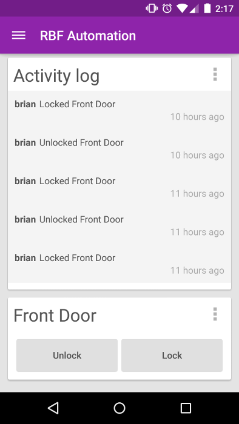

#RBF Android Client

#Setup

Setup is pretty easy

###1. Import project into android studio
This should be pretty straightforward.

###2. Set up SSL
NOTE:
This guide is based off of [this](http://blog.antoine.li/2010/10/22/android-trusting-ssl-certificates/) guide.

This assumes you have your SSL.crt from the web server. This guid will not cover how to create an SSL cert.

[Download BouncyCastle Provider](http://bouncycastle.org/download/bcprov-jdk16-145.jar)

####generate the keystore

keytool -importcert -v -trustcacerts -file "path_to_cert/interm_ca.cer" -alias IntermediateCA -keystore "keystore.bks" -provider org.bouncycastle.jce.provider.BouncyCastleProvider -providerpath "path_to_bouncycastle/bcprov-jdk16-145.jar" -storetype BKS -storepass YOUR_PASSWORD

Where `YOUR_PASSWORD` is your keystore password (you will need this for the next part and step 3)

####Verify the key is in the keystore

keytool -list -keystore "keystore.bks" -provider org.bouncycastle.jce.provider.BouncyCastleProvider -providerpath "bcprov-jdk16-145.jar" -storetype BKS -storepass YOUR_PASSWORD

Where `YOUR_PASSWORD` is your keystore password.

####Move Keystore into the project
Put the keystore in /res/raw/keystore.bsk

###3. Setup Credentials.java
Go to `RBFAutomation/app/src/main/java/com/rbfautomation/network/Credentials.java.example` and copy it to `RBFAutomation/app/src/main/java/com/rbfautomation/network/Credentials.java`

Then fill out the file with the required information.

###4. Ensure the web service is working and go!
